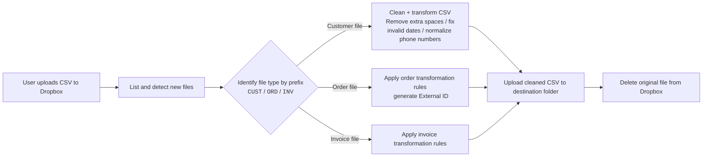

# Ruby Dropbox File Automation

This project automates the processing and routing of uploaded CSV files using the Dropbox API.  
It detects files, cleans/transforms data when needed, and moves them to the correct destination folder.

---

## ✅ What this automation does

- Connects to Dropbox using the Dropbox API.
- Detects new uploaded files in a configured folder.
- Identifies each file by its prefix (example: `CUST`, `ORD`, `INV`).
- Transforms CSV data:
  - Removes extra spaces / double quotes.
  - Validates and formats dates.
  - Fixes invalid phone numbers.
- Generates cleaned CSV files (`orders.csv`, `invoices.csv`, `customers.csv`).
- Uploads the processed file into the correct destination folder.
- Deletes the original file from Dropbox once processed.

---

### 🧠 Architecture diagram



---

## 📁 Project structure

```
/ruby_dropbox_file_automation
│── helpers/
│   ├── constants.rb         # File mappings and CSV headers
│── main.rb                  # Main logic that processes files
│── scheduled_worker.rb      # Background execution (cron-style)
│── config.yml.example       # Editable configuration template
└── README.md
```

---

## 🛠 Tech Stack

| Component      | Technology   |
|----------------|--------------|
| Language       | Ruby         |
| Integration    | Dropbox API  |
| File processing| CSV          |
| Scheduling     | Cron worker  |
| Config         | YAML         |

---

## ⚙️ Configuration

Create your own configuration file from the template:

```sh
cp config.yml.example config.yml
```

Then edit `config.yml` to set:

- API keys
- Folder paths
- Cron settings (if scheduled)

---

## ▶️ How to Run

```sh
ruby main.rb
```

Or, if using the scheduled worker:

```sh
ruby scheduled_worker.rb
```

---

## 🚀 Purpose

This automation avoids manual handling of files uploaded to Dropbox.  
It ensures that CSVs are standardized, validated, and routed to their correct destination automatically.

---

### ✉️ Contact

If you have questions or want to collaborate:  
**ivan.rivas00@gmail.com**

